  

## 🎮 About This Profile

I build gameplay systems, full-stack web apps, and practical data solutions.
This profile highlights selected projects, tools, and technical growth across game development, web engineering, and database design.

---

## 🐍 Contribution Snake

  <picture>
    <source media="(prefers-color-scheme: dark)" srcset="https://raw.githubusercontent.com/Ryan12450/Ryan12450/output/github-contribution-grid-snake-dark.svg"/>
    <source media="(prefers-color-scheme: light)" srcset="https://raw.githubusercontent.com/Ryan12450/Ryan12450/output/github-contribution-grid-snake.svg"/>
    
  </picture>

---

## ⚔️ Skill Tree

### 🗡️ Languages

### 🛡️ Frameworks & Libraries

### 🧰 Tools & Databases

---

## 🏆 Completed Quests

### 🚀 [Spaceship Engineer](https://github.com/Ryan12450/cos20007-oop-spaceship-engineer)
> `C#` · `Raylib-cs` · `OOP` · `Unit Testing`

2D action-adventure game with scene/state management, inventory and repair systems, multi-level progression, reusable game managers, and unit-tested components.

---

### ☕ [Brew & Go Coffee Shop Platform](https://github.com/Ryan12450/cos10026-webtech-assignment2)
> `PHP` · `MySQL` · `Full-Stack` · `Admin Dashboard`

Full-stack e-commerce and membership platform with authentication, cart/checkout flow, payment handling, admin back-office, and CRUD operations.

---

### 🎯 [Color Match Game](https://github.com/Ryan12450/cos10009-color-match-game-c)
> `C` · `Raylib` · `Game Loop` · `File I/O`

10-level progressive game with modular screen-based architecture, collision logic, gameplay scaling, and persistent achievement tracking.

---

### 🏥 [Hospital Information System Design](https://github.com/Ryan12450/cos20031-hospital-db-design)
> `MySQL` · `Database Design` · `Normalization`

Relational database design for healthcare operations — normalized schema, indexing strategy, and audit-focused data structures.

---

### 📚 [Library Management System](https://github.com/Ryan12450/fst10014-library-management-system)
> `Python` · `CustomTkinter` · `MySQL` · `Excel Export`

Desktop management app with role-based flows, lending/return logic, room booking, payment tracking, and Excel reporting.

---

### 🗺️ [Kyoto Travel Guide Website](https://github.com/Ryan12450/fst10011-kyoto-travel-guide-website)
> `HTML` · `CSS` · `JavaScript` · `Responsive Design`

Responsive travel website with multi-page architecture, search-friendly layout, and mobile-first navigation.

---

### 🧪 [Software Testing & Reliability](https://github.com/Ryan12450/swe30009-software-testing-reliability)
> `Test Planning` · `Defect Analysis` · `Reliability Engineering`

Course project on software quality validation, test planning, defect-focused scenarios, and evidence-based documentation.

---

### 🛡️ [Greenway Energy Malware Analysis](https://github.com/Ryan12450/malware-analysis-greenway)
> `YARA` · `PE Analysis` · `IOC Extraction` · `Malware Detection`

Custom YARA rule for downloader/dropper detection with PE header validation, import-based logic, and IOC extraction.

---

## 📊 Game Analytics

  
  

  

---

## 📡 Connect & Co-op

  
  

---

  <i>🎮 Open to collaboration on game systems, full-stack web apps, and data-driven software. If you're building something technically ambitious — <b>let's party up.</b></i>

